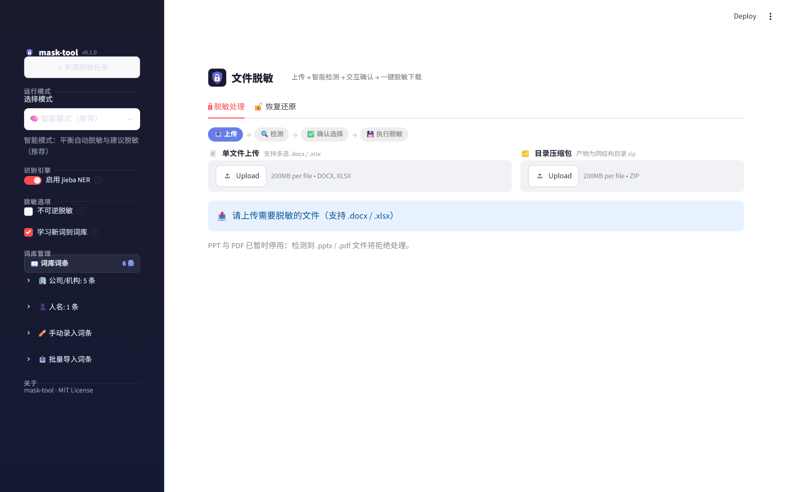

<div align="center">


# mask-tool

**本地文件脱敏工具 —— 敏感信息一键替换，原文可逆还原**

把 Word / Excel 里的公司名、人名、证件号、金额等敏感信息替换为 `[COMPANY_001]` 这样的占位符，
交给 AI 或外部系统处理后，再用映射表一键还原原文。

[](https://www.python.org/)
[](https://streamlit.io/)
[](https://pywebview.flowrl.com/)
[](https://github.com/WUJinda/MaskTool/tree/main/tests)
[](LICENSE)



</div>

---

## ✨ 特性

- **🔁 完全可逆** —— 敏感信息替换为唯一 Token（`[COMPANY_001]`），凭 `mapping.json` 无损还原；还原后自动对账扫描，残留 Token 即报错
- **🧠 智能识别** —— 词库精确匹配 + 正则（手机号 / 身份证 / 银行卡 / 邮箱 / 日期）+ jieba NER，按置信度分级处置
- **📄 深度格式覆盖** —— docx 正文 / 表格 / 嵌套表格 / 页眉页脚 / 脚注尾注 / 批注 / 文本框；xlsx 单元格 / 富文本 / 公式字面量 / 批注 / 数据验证列表
- **🗂 文件名也脱敏** —— 目录模式下输出镜像树的文件名 / 目录名同步脱敏，映射表 `paths` 段记录，可一并还原
- **🖥️ 桌面应用** —— 原生窗口（pywebview + WebView2），双击即用、关窗即退；UI 由内置 Streamlit 内核驱动，仅本机回环通信，无需浏览器与命令行
- **🔒 本地优先** —— 仅监听 `127.0.0.1`，关闭遥测，全程无外部 API 调用，数据不出本机
- **📦 批次化管理** —— 每次运行产物写入独立批次目录，映射表带批次标识与指纹，防跨批次混用

## 🚀 快速开始

### 方式一：免安装便携版（Windows 普通用户推荐）

1. 从 [Releases](https://github.com/WUJinda/MaskTool/releases) 下载 `mask-tool-portable-v*.zip`（约 110 MB）
2. 解压到任意目录（免管理员权限，不写注册表，卸载即删目录）
3. 双击 `mask-tool.exe` —— 依赖全部内置，仅需系统 WebView2 运行时（Win10 较新版本 / Win11 随 Edge 自带）

> 个人词库（`config/lexicon.yaml`）与配置保存在 exe 同级目录，随目录一起迁移；升级覆盖软件目录前请先备份词库。

### 方式二：Python 安装（开发者 / macOS）

```bash
# 安装（Python ≥ 3.9）
pip install -e .

# 桌面应用完整依赖（UI 内核 + 原生窗口）
pip install -e ".[app]"

# 生成默认配置与示例词库
mask-tool config
```

| 入口 | 命令 | 适合场景 |
| --- | --- | --- |
| 🖥️ 桌面窗口 | 双击 `start-windows.bat` / `start-mac.command`，或 `mask-tool app` | 日常使用，原生窗口 + 原生保存对话框 |
| ⌨️ 命令行 | `mask-tool mask / inspect / unmask / config` | 脚本化、批量任务 |

> 独立浏览器/Web 入口（`mask-tool-web`）已下线：UI 仅在桌面窗口内渲染。

**桌面四步流程**：`📤 上传` → `🔍 检测` → `✅ 确认选择` → `💾 执行脱敏`，随后在「恢复还原」页上传脱敏文件 + `mapping.json` 即可还原。

## 🖥️ 桌面应用高级用法

- **临时自定义敏感词**：检测页文本框手动指定本次关注的词（每行一个或逗号分隔），按词库语义精确匹配、置信度 0.95 自动脱敏，生成 `[CUSTOM_xxx]` Token 并标「✍️ 手动」来源；仅本次任务生效，不写入词库文件
- **仅脱敏我指定的词**：开关开启后完全跳过自动检测（NER / 正则 / 词库均不运行），只处理手动指定的词
- **目录批量脱敏**：整个目录压成 zip 上传，递归处理其中 docx / xlsx，产物为同结构 zip；屏蔽类型（pptx / pdf）警告列出不进产物；还原页对称支持 zip 还原
- **误报排除**：自动检测误报的词可加入 `config/whitelist.yaml` 永久排除
- **下载规则**：单文件直接下载同名产物；多文件 / zip 下载压缩包。⚠️ `mapping.json` 是还原钥匙（含原文对照），请与脱敏文件分开保管，勿一起外发

## ⌨️ CLI 速查

```bash
# 检测预览（不执行脱敏）
mask-tool inspect ./项目资料/

# 脱敏（smart 模式，默认仅替换"自动脱敏"项）
mask-tool mask input.docx --mode smart --output ./output/

# 建议脱敏项也替换 / 交互式逐项勾选
mask-tool mask input.docx --all
mask-tool mask input.docx --confirm
# --confirm 下未勾选（内容未脱敏）的文件会隔离到镜像树内 skipped_unmasked/ 子目录，勿作为脱敏产物分发

# 目录递归（文件名同步脱敏，--no-mask-names 关闭）
mask-tool mask ./项目资料/ --output ./output/

# 还原原文（目录输入时内容与文件名一并还原）
mask-tool unmask "<批次目录>/<脱敏后目录>" --mapping "<批次目录>/mapping.json" --output ./restored
```

每次 `mask` 运行创建独立批次目录 `output/<时间戳-短uuid>/`：脱敏产物 + `mapping.json`（含 `paths` 段与指纹）+ `report.json`。`mask` 结束时会打印还原命令示例；跨批次混用或映射表被改动可通过 `--verify`（指纹复算比对）发现。

<details>
<summary><b>🛡️ 还原防线（unmask M3）与处置分级</b></summary>

**unmask 防线**：

- **还原后对账扫描**：输出全文若残留映射表内的 Token（还原缺陷）将报错退出，`--force` 可忽略；残留不在映射表内的 Token 样式文本仅警告，不做还原
- **编号让位**：mask 前预扫描文档中已存在的 Token 样式串（如 `[PERSON_001]`），新生成编号自动跳过，防止撞号导致误还原
- **源文件对账**：unmask 启动时将实际输入与映射表登记的源文件清单比对，完全无交集时警告（不阻断）

**处置分级**（smart 模式）：

| 级别 | 置信度 | 默认行为 |
| --- | --- | --- |
| 自动脱敏 | ≥ 0.85 | 替换 |
| 建议脱敏 | ≥ 0.6 | 列出，`--all` 时替换 |
| 仅提示 | < 0.6 | 列出，不替换 |

**运行模式**：

| 模式 | 说明 |
| --- | --- |
| `focused` | 仅词库精确匹配（0.95）自动脱敏 |
| `strict` | 仅高置信度自动脱敏（0.95），次高建议 |
| `smart`（默认） | 词库 + 正则 + NER，标准阈值 |
| `aggressive` | 高召回优先，降低阈值 |

</details>

## 🎯 脱敏对象

| 类别 | 来源 / 示例 |
| --- | --- |
| 公司 / 机构 / 政府 | 词库 + NER |
| 人名 / 地名 | NER（jieba） |
| 项目名 / 标的物 / 自定义关键词 | 词库 |
| 金额 | `token` 可逆 / `fuzzy` 模糊化（1.2亿 → 1亿+）/ `fixed` 即 `***` |
| 手机号 / 身份证 / 银行卡 / 邮箱 / 日期 | 正则 |

## 📋 能力边界

| 格式 | 状态 | 说明 |
| --- | --- | --- |
| Word (.docx) | ✅ 支持 | 全部件覆盖（见特性）；文档属性（作者等元数据）自动清空 |
| Excel (.xlsx) | ✅ 支持 | 单元格 / 富文本 / 数字（货币格式、Luhn 卡号）/ 公式字面量 / 批注 / 页眉脚 / 数据验证列表 / 定义名称 |
| 文件名 / 目录名 | ✅ 支持 | 目录模式镜像树自底向上改名，可还原 |
| PowerPoint (.pptx) | ⛔ 屏蔽 | 跨 run 替换可靠性未达标准（代码保留，命中即警告跳过） |
| PDF (.pdf) | ⛔ 屏蔽 | 无回写能力（代码保留，命中即警告跳过） |

<details>
<summary><b>⚠️ 已知限制（交付前请阅读）</b></summary>

- **docx 修订记录**：未接受的修订（`w:ins` / `w:del`）不处理，修订删除的文本不参与检测替换，修订人姓名等元数据不清除。交付前请先接受所有修订
- **段内混合格式退化**：docx 中替换发生过的段落，整段文本并入首个 run（保留其格式），该段其余 run 的局部格式（加粗 / 颜色等）不再生效
- **跨 tab/换行实体**：跨制表符 / 软换行的实体可被检测替换与还原，但重建后 tab / 换行可能位置漂移（偏离原位置），重要文档请人工复核
- **roundtrip 前提**：unmask 仅保证对未再编辑的脱敏文档完整还原；xlsx 批注作者单向清除，不在还原范围
- **xlsx 大整数精度**：≥16 位的整值数字在未脱敏保留时统一预转为文本存储（逐位保真）；16–19 位 Luhn 校验通过的卡号还原为数值，超过 19 位还原为文本
- **检测临时副本**：检测后直接关闭窗口时，上传副本可能残留在系统 temp 目录；建议完成脱敏流程或再次点击「重新检测」触发清理
- **xlsx 线程批注**：openpyxl 不支持 threadedComments，保存时该部件会被丢弃，运行时有告警
- **路径超长**：改名后绝对路径超过 Windows MAX_PATH 限制时保留原名（不截断 Token）并警告

</details>

## ⚙️ 配置

编辑 `config/default.yaml`，或命令行参数覆盖。配置加载回退链：显式 `--config`（缺失即报错）→ 当前目录 `config/default.yaml` → 内嵌模板 → 纯代码默认；每次回退均警告并打印生效的词库路径。`lexicon.yaml` 缺失时自动从同目录 `sample_lexicon.yaml` 复制创建，桌面窗口侧边栏「词库管理」支持增删与批量导入（YAML / TXT）。

## 📁 项目结构

```sh
├── src/mask_tool/
│   ├── cli/          # CLI 入口（app 启动桌面窗口 / mask / unmask / inspect / config）
│   ├── core/         # 核心业务（替换引擎 / 检测 / 策略 / 流水线 / 路径脱敏）
│   ├── adapters/     # 格式适配器（docx / xlsx；pptx / pdf 已屏蔽）
│   ├── web/          # Streamlit UI 内核（仅供桌面窗口内部渲染，无独立浏览器入口）
│   ├── desktop.py    # pywebview 桌面窗口主入口
│   ├── store/        # 持久化（映射表 / 词库）
│   ├── models/       # 数据模型
│   └── utils/
├── config/           # 配置与词库（config 命令可再生成）
├── tests/            # pytest 测试
├── assets/           # 应用图标
└── docs/             # README 图片资产
```

## 🧪 开发

```bash
pip install -e ".[dev]"

# 运行测试（Windows 建议 PYTHONIOENCODING=utf-8）
pytest
```

## 📄 License

[MIT](LICENSE)

## 🙏 开源声明

本项目基于 [ZagooYWX/mask-tool](https://github.com/ZagooYWX/mask-tool)（MIT License）改造，感谢原作者的开源工作。

---

<div align="center"><sub>Made with ❤️ · 本地运行 · 数据不出本机</sub></div>
